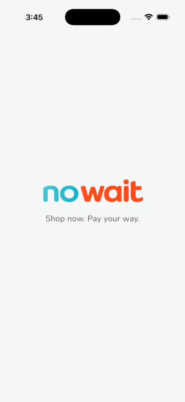
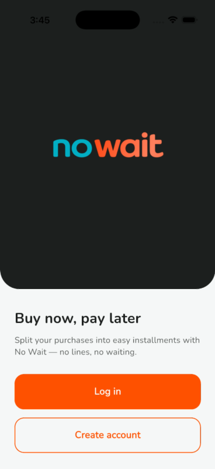
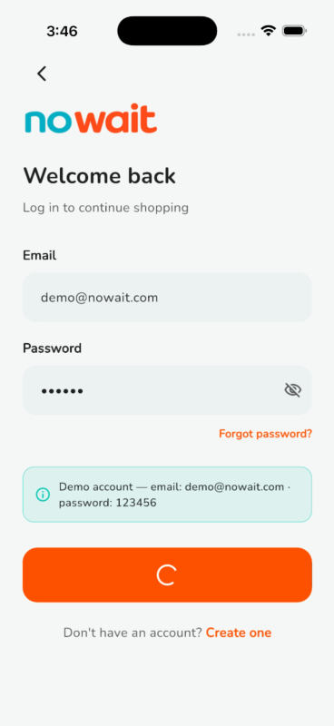
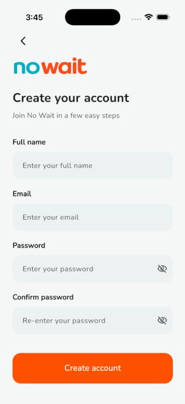
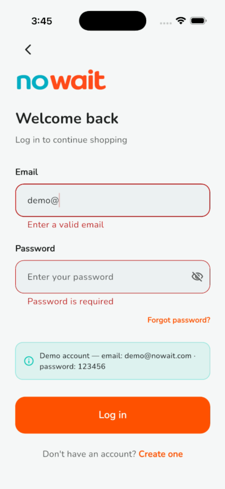
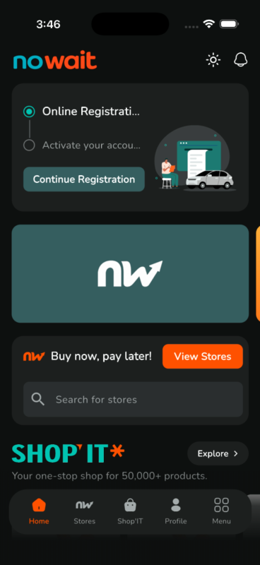
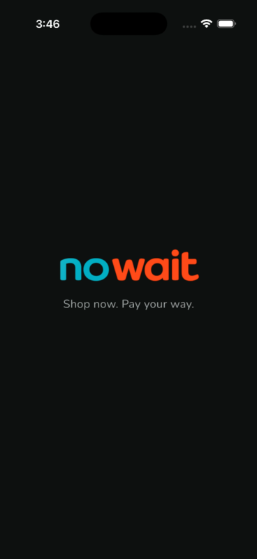
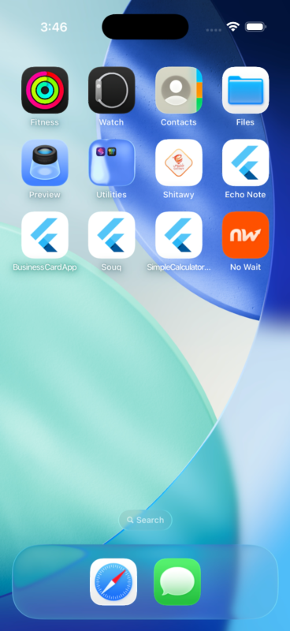

# No Wait

A **buy now, pay later** Flutter app built with a production-grade architecture. Originally started as a valU home-screen clone, now rebranded and growing sprint by sprint.

## 🎥 Demo video

[▶️ Watch the Sprint 1 demo](assets/demo_videos/sprint1_demo.mov) — splash → intro → register → login (validation, demo account, loading) → home, with the new branding and launcher icon.

## 📸 Screenshots

| Splash (light) | Intro | Login | Register |
|:---:|:---:|:---:|:---:|
|  |  |  |  |

| Login validation | Home (dark) | Splash (dark) | Launcher icon |
|:---:|:---:|:---:|:---:|
|  |  |  |  |

## Features

- 🎨 **Light & Dark themes** — persisted with `ThemeCubit` + SharedPreferences, in-app toggle in the header
- 🌍 **Localization** — English & Arabic with full RTL support (`easy_localization`)
- 🧩 **Feature-first Clean Architecture** — `core/` (theme, routing, DI, animations, error handling) + `features/`
- 📱 **Responsive** — `flutter_screenutil` (design size 360×690)
- ✨ **Motion** — consistent entrance/tap animations via a shared `flutter_animate` kit, Lottie illustrations
- 🖼️ No Wait brand assets (`assets/images/logo/`) + generated launcher icons

## Sprint progress

| Sprint | Scope | Status |
|---|---|---|
| Sprint 1 (KAN-1) | Project setup, Splash, Intro, Login, Register | ✅ In review |
| Sprint 2 (KAN-2) | Home & products | Home screen UI done, rest pending |
| Sprint 3 (KAN-3) | Menu section | Pending |
| Sprint 4 (KAN-4) | Profile & orders | Pending |

## App flow (Sprint 1)

Splash → Intro (Login / Register entry) → Login / Register → Home

Auth is UI-complete with simulated repository calls (`features/auth/repository/auth_repository_impl.dart`) — swap in a real datasource when the backend lands.

## Screen anatomy (Home)

| Section | Widget |
|---|---|
| Header (logo, theme toggle, notifications) | `home_header.dart` |
| Registration stepper card + Lottie | `registration_progress_card.dart` |
| Promo banner carousel | `promo_banner_carousel.dart` |
| Buy now, pay later + store search | `bnpl_section.dart` |
| SHOP'IT product rail | `shop_it_section.dart` / `product_card.dart` |
| Floating bottom navigation with fade | `home_bottom_nav_bar.dart` |

## Getting started

```bash
flutter pub get
flutter run
```

To regenerate launcher icons after changing the logo:

```bash
dart run flutter_launcher_icons
```

## Stack

`flutter_bloc` · `get_it` · `dartz` · `easy_localization` · `flutter_screenutil` · `flutter_svg` · `lottie` · `flutter_animate` · `google_fonts`
